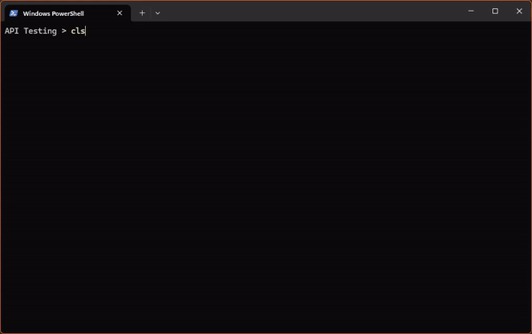

# CloudShare Onboarding Automation Script

This Python script automates the onboarding process for new customers on the CloudShare platform. It streamlines project creation, user invitation, and environment setup, making it easier to get new customers up and running quickly.



## What This Script Does

Here's a step-by-step breakdown of the script's functionality:

1. **API Connection Check**: 
   - The script starts by checking the connection to the CloudShare API.
   - It uses a simple ping request to ensure everything is working correctly.

2. **User Email Retrieval**:
   - The script fetches the email of the user running the script.
   - This email is later used as the owner email for the created environment.

3. **Customer Information Input**:
   - You'll be prompted to enter the customer's name. What you type here will be used to make the Project name (NEXTGEN CyberLAB - {project name})

4. **User Loading**:
   - The script checks for a `users.csv` file in the same directory.
   - If found, you can choose to use these pre-defined users or input users manually. If not found you will be prompted for manual input
   - For manual input, you'll be asked for each user's email, first name, last name, and user level.

5. **Project Creation**:
   - A new project is created in CloudShare using the customer's name.

6. **Team ID Retrieval**:
   - The script fetches the team ID associated with the newly created project.

7. **Policy ID Retrieval**:
   - The script gets the policy ID for the project, which is needed for environment creation.

8. **User Invitation**:
   - Each user is invited to the project with their specified role (Team Member, Team Manager, or Project Manager).

9. **Environment Creation**:
   - Finally, the script creates a standard environment with predefined virtual machines:
     - Windows Server 2022 Standard
     - Ubuntu 22.04 LTS Desktop
     - Kali Linux 2022
     - CentOS 8 Server

10. **Error Logging**:
    - Throughout the process, any errors are logged.
    - At the end of the script, a detailed error log is displayed if any issues occurred.

## Requirements

- Python 3.6+
- `requests` library

## Usage

1. Ensure you have the correct API credentials in the script (`API_ID` and `API_KEY`).
2. (Optional) Prepare a `users.csv` file in the same directory as the script with the following format:

| email                | first_name | last_name | user_level |
|----------------------|------------|-----------|------------|
| user1@example.com    | John       | Doe       | 8          |
| user2+tag@example.com| Jane       | Smith     | 4          |

   Note: The user_level column is optional. If not provided, users will be added as Project Managers (level 8).
3. Run the script:
   ```bash
   python CL-Onboard.py
   ```
4. Follow the prompts to complete the onboarding process.

## SSL Certificate Requirements

This script uses HTTPS for all API calls. It relies on the `requests` library, which typically uses the certificates from your operating system's certificate store. If you encounter SSL certificate issues:

1. Ensure your system's root certificates are up to date.
2. If using a corporate network, check with your IT department about any custom certificate requirements.

## Error Handling

If any errors occur during the process, a detailed error log will be displayed at the end of the script execution. This log includes information about API requests, responses, and any exceptions encountered. If you see errors, please send this log to hayden.loader@nextgen.group for assistance.

## Contributing

Contributions to improve the script are welcome. Please feel free to submit pull requests or open issues for any bugs or feature requests.

## Contact

For any questions or support, please contact hayden.loader@nextgen.group.
